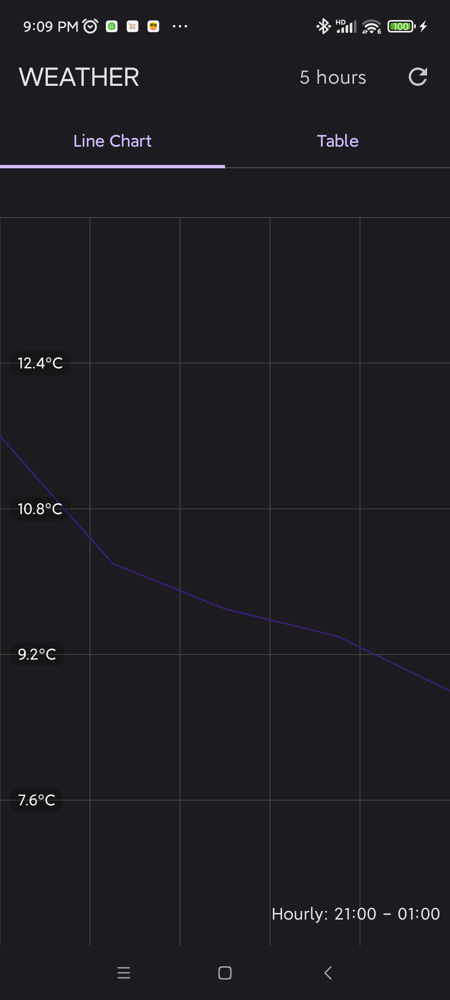
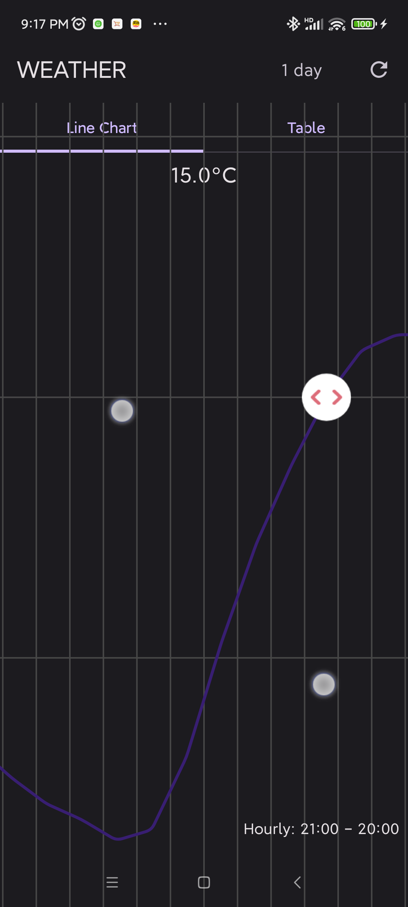
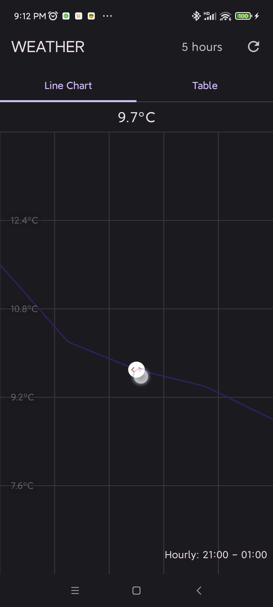
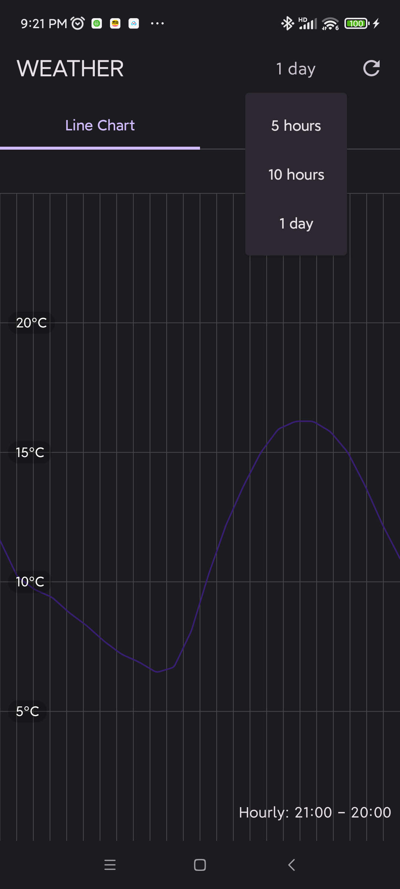

A simple mobile app that fetches weather data from an API and displays:
1.A chart showing the temperature variation over time.
2.A table listing the temperatures.
For specific scenarios, please refer to the video demonstration [weather.mp4](doc/weather.mp4).

**Features:**

- Line chart page 

- The chart cam be interactive with pinch-to-zoom 

- Table page 

- Refresh and sync data by clicking top-right button
- It could select a duration

- Add custom animations when switching tab between Line_chart and Table.

## How to run the app

Clone the repository to your local machine.
Open the project in Android Studio.
Wait for Android Studio to sync the project and download the necessary dependencies.
Connect an Android device or use an emulator.
Run the app from Android Studio by clicking the "Run" button.

## Install dependencies

The necessary dependencies are defined in the build.gradle.kts file. Android Studio will
automatically download and install them when you sync the project.

## Test the app

Make sure your device or emulator has an active internet connection.
When the app starts, it will request location permission. Grant the permission to fetch the weather
data based on your location.
If the data fetch is successful, you will see a line chart showing the hourly temperature and a
table listing the temperature data.
If there is an error, an error message will be displayed.